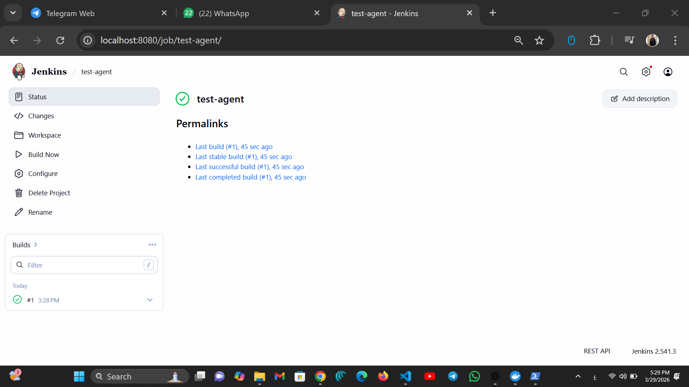
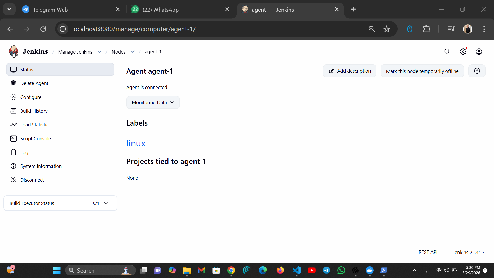
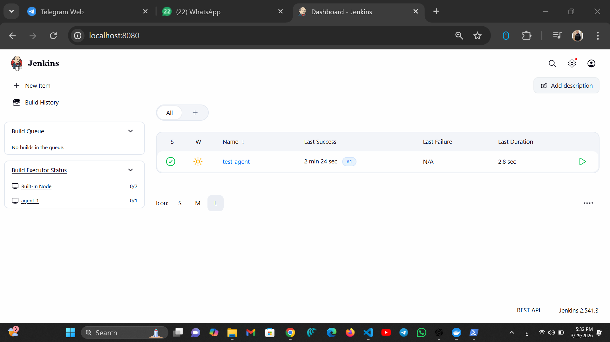
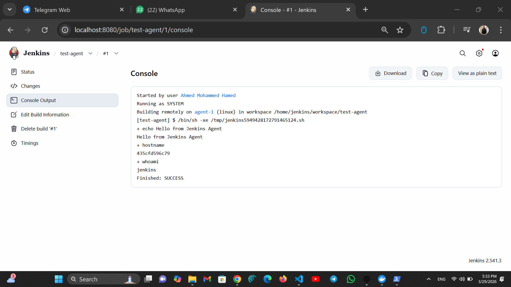
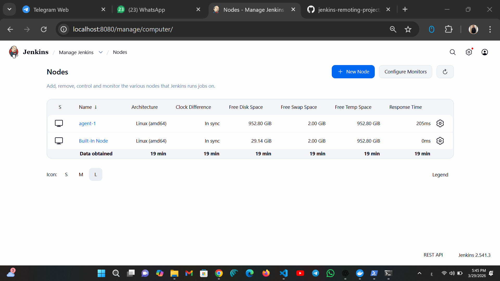

# 🚀 Jenkins Remoting Project (CodeAlpha DevOps Task 2)

## 📌 Overview

This project demonstrates how to implement **Jenkins Remoting** by setting up a **Jenkins Master** and connecting a **Remote Agent (Node)** using Docker.

The goal is to distribute build workloads across different machines and execute jobs remotely, following DevOps best practices.

---

## 🧠 Key Concepts Covered

* Jenkins Master-Agent Architecture
* Jenkins Remoting (JNLP/WebSocket)
* Distributed Builds
* Docker Containerization
* Job Execution on Remote Nodes

---

## 🛠️ Tools & Technologies

* Jenkins
* Docker
* Git & GitHub
* Linux (Agent Environment)

---

## 📁 Project Structure

```
jenkins-remoting-project/
│
├── docker-compose.yml
├── docs/
│   ├── dashboard.png
│   ├── agent-online.png
│   ├── job-config.png
│   ├── console-output.png
│   └── nodes.png
└── README.md
```

---

## ⚙️ Setup & Installation

### 1️⃣ Run Jenkins Master

```bash
docker-compose up -d
```

---

### 2️⃣ Access Jenkins

Open in browser:

```
http://localhost:8080
```

---

### 3️⃣ Unlock Jenkins

```bash
docker exec jenkins-master cat /var/jenkins_home/secrets/initialAdminPassword
```

---

### 4️⃣ Create Agent (Node)

* Go to: **Manage Jenkins → Nodes → New Node**
* Name: `agent-1`
* Type: Permanent Agent
* Label: `linux`

---

### 5️⃣ Connect Agent using Docker

```bash
docker run -d --name jenkins-agent \
-e JENKINS_URL=http://host.docker.internal:8080 \
-e JENKINS_AGENT_NAME=agent-1 \
-e JENKINS_SECRET=YOUR_SECRET \
jenkins/inbound-agent
```

---

## 🧪 Create & Run Job

### Build Script:

```bash
echo "Hello from Jenkins Agent"
hostname
whoami
```

### Important:

Enable:

```
Restrict where this project can be run → linux
```

---

## 📸 Screenshots

### 🖥️ Jenkins Dashboard



---

### 🔗 Agent Connected



---

### ⚙️ Job Configuration



---

### 📊 Console Output



---

### 🧩 Nodes Overview



---

## ✅ Results

* Successfully connected Jenkins Agent
* Executed jobs on remote node
* Verified distributed build execution
* Improved system scalability and performance

---

## 🎯 Conclusion

This project demonstrates how Jenkins Remoting enables scalable and distributed CI/CD pipelines by offloading workloads to remote agents.

---

## 👨‍💻 Author

**Ahmed Mohammed Hamed**

---

## 🔗 GitHub Repository


---
